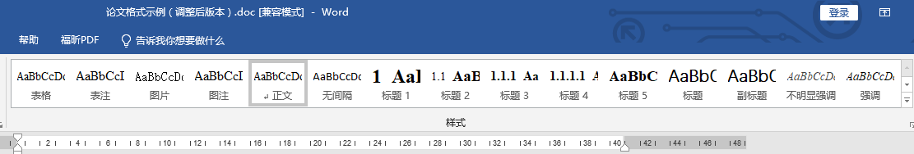
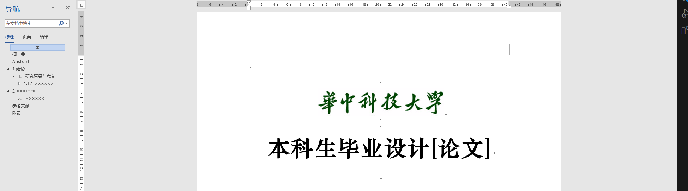
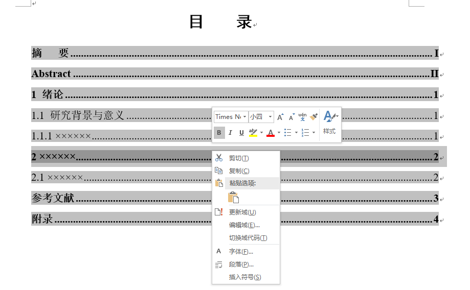
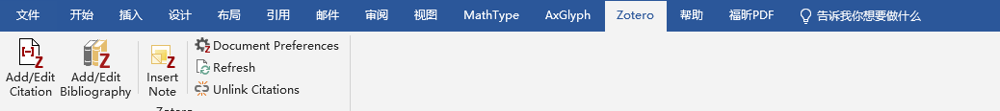

# 华中科技大学电气与电子工程学院毕业设计模板
    每到毕业季，毕业论文总会成为大四学子的一个重大任务
    而除了书写毕业论文之外，调整毕业论文的格式也是一项耗时耗力的任务
    因此，为了方便大家能够又快又好地调整好格式，已制作好电气学院要求的word版样式和zotero引用格式
    大家直接拿来用就好啦！（所以电气学院为什么还不用latex写毕设！怨念max）
本项目的Github仓库地址为：[https://github.com/Only-Don/SEEE_Thesis](https://github.com/Only-Don/SEEE_Thesis)。

## 目录
- [华中科技大学电气与电子工程学院毕业设计模板](#华中科技大学电气与电子工程学院毕业设计模板)
  - [目录](#目录)
  - [word论文格式](#word论文格式)
  - [zotero引用格式](#zotero引用格式)

## word论文格式
打开[论文格式示例](论文格式示例（调整后版本）.doc)，word右上方将显示一系列样式，包含表格、表注、图片、图注、标题1、标题2等，请在书写论文的时候及时对标题、表格、图片应用对应的样式，这将为后续的排版带来极大的方便。

例如对每个标题都采用了正确的标题样式，此时打开 **视图->显示->导航窗格**，即可在左侧的导航中按照标题生成对应的目录。

另外目录也已按照要求修改完毕，在完成论文后右键目录进行更新域操作即可。

## zotero引用格式

若要使用zotero引用格式，请先下载zotero，打开zotero后双击[论文格式程序](china-national-standard-gb-t-7714-2015.csl)，即可自动安装。（此时可能弹出报错提示，确定即可，无需理会）

在安装完成后，进入word中，选择顶端zotero选项卡，点击Document Preferences选择好对应引用格式，再在需要引用的地方使用Add/Edit Citation进行引用，最后在参考文献部分使用Add/Edit Bibliography即可完成参考文献的插入，具体使用方法请上网查找相应教程~

